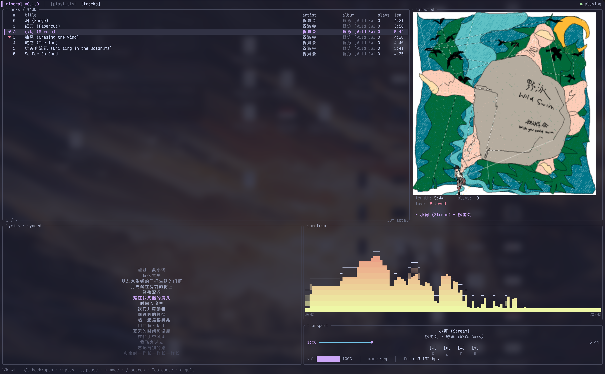

# Mineral

本项目基于 `简洁`, `音乐为中心` 的出发点构建

- 名字取自 [Mineral](https://en.wikipedia.org/wiki/Mineral_(band)) —— 90 年代得州的 emo / post-rock 乐队。



## 特性

- **多源融合**:`MusicChannel` trait 统一抽象搜索、详情、播放 URL、歌词、用户数据;新增 channel 不污染数据模型。
- **真实播放栈**:rodio + symphonia + stream-download,支持 mp3 / aac / m4a / flac;seek、auto-next、Shuffle、循环模式齐全。
- **歌词**:LRC 行级显示 + YRC 字符级 wipe 渐变(逐字),Apple Music 风格 fade。
- **频谱**:realfft 真值 + peak hold 弹簧物理 + HSV 色相缓慢漂移。
- **封面**:ratatui-image,kitty / iTerm2 / sixel / halfblock 自适配,字号变化按 dims 重建,滚动期间自动防抖避免卡顿。
- **任务调度**:优先级 lane(User / Background) + 取消 + dedup,封面 / 歌单 / 歌词分别走自己的 worker。
- **平铺数据模型**:`Song` / `Playlist` / `Album` / `Lyrics` 都是平铺字段 + `SourceKind` 标签,跨 channel 直接合并展示。

## 构建

需要 stable Rust(`rust-version >= 1.78`)。

```bash
# 构建整个 workspace
cargo build --release

# 仅构建 TUI binary
cargo build -p mineral --release
```

## 运行

```bash
# 真实数据源(需要先 login,见下)
cargo run -p mineral --release

# 离线开发:跑 mock channel 拿假数据,不打任何网络端点
cargo run -p mineral --release --features mock
```

首次启动若 sidebar 提示 `尚未登录或拉取失败`,在另一个终端执行 login:

```bash
cargo run -p mineral -- channel netease login
```

会打印一张终端二维码,用对应 App 扫码确认即可。凭证写入 `<data_dir>/netease.json`,后续启动 TUI 自动读取。

## 路径

遵循 XDG Base Directory:

| 用途 | 路径 |
|---|---|
| 配置 | `$XDG_CONFIG_HOME/mineral`(默认 `~/.config/mineral`) |
| 数据(凭证、缓存歌单等) | `$XDG_DATA_HOME/mineral`(默认 `~/.local/share/mineral`) |
| 缓存(封面、流式下载) | `$XDG_CACHE_HOME/mineral`(默认 `~/.cache/mineral`) |
| 日志 | `<cache_dir>/mineral.log` |

## 快捷键

### 全局

| 键 | 动作 |
|---|---|
| `q` | 退出(带确认) |
| `Space` | 播放 / 暂停 |
| `n` / `p` | 下一首 / 上一首(`p` 在播放 > 3s 时回到本曲开头) |
| `←` / `→` | 后退 / 前进 5s |
| `Shift+←` / `Shift+→` | 后退 / 前进 30s |
| `+` / `-` | 音量 ±5 |
| `m` | 循环模式切换(顺序 / 单曲 / Shuffle) |
| `3` | 打开 / 关闭 queue 浮层 |

### 列表(playlists / library)

| 键 | 动作 |
|---|---|
| `j` / `k` 或 `↓` / `↑` | 上下移动 1 行 |
| `Shift+J` / `Shift+K` | 上下移动 7 行 |
| `g` / `G` | 跳到首 / 末 |
| `l` / `Enter`(playlists) | 进入选中歌单 |
| `h` / `Backspace`(library) | 回到 playlists |
| `Enter`(library) | 播放选中曲 + 整张歌单进 queue |
| `/` | 进入搜索过滤(playlists 按名,library 按名 / 艺术家 / 专辑) |
| `Esc` | 有过滤词时清过滤(留在当前视图);否则 library → playlists |

### 搜索输入态

| 键 | 动作 |
|---|---|
| 字符 / `Backspace` | 增 / 删过滤词 |
| `Enter` | 退出输入态,过滤词保留 |
| `Esc` | 清过滤词 + 退出输入态 |

## 开发

```bash
# 跑所有测试
cargo test --workspace

# 加密 byte-for-byte 比对(改 crypto 必跑)
cargo test --test crypto_vectors

# 格式化 + 严格 lint(CI 用)
cargo fmt --check
cargo clippy --workspace --all-targets -- -D warnings

# 跑 TUI(离线 mock 模式)
cargo run -p mineral --features mock
```

## 致谢

感谢以下项目带来的启发与参考:

- [ratatui](https://github.com/ratatui/ratatui) — 优秀的 Rust TUI 框架。
- [yazi](https://github.com/sxyazi/yazi) — 终端文件管理器,图像渲染细节上学到很多。
- [go-musicfox](https://github.com/go-musicfox/go-musicfox) — 设计与交互上的参考。
- [termusic](https://github.com/tramhao/termusic) — 同类 Rust TUI 播放器,值得借鉴的工程实践。

## 许可证

[MIT](./LICENSE)
