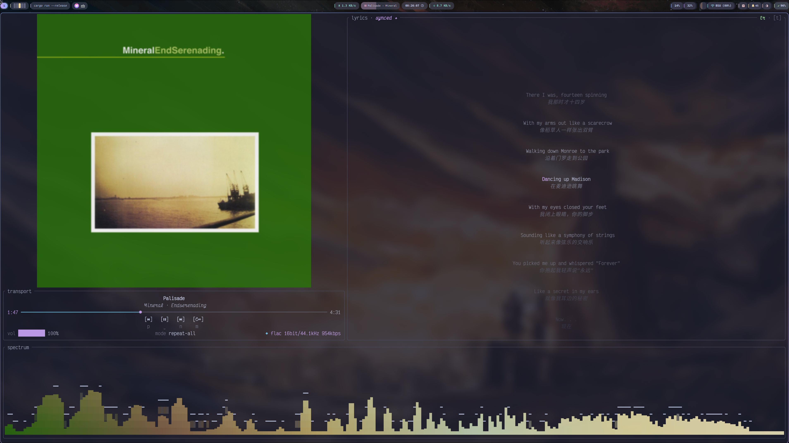

<div align="center">

# Mineral

**多源终端音乐播放器 —— 简洁,音乐为中心**

[](https://github.com/10knamesmore/Mineral/actions/workflows/ci.yml)
[](https://aur.archlinux.org/packages/mineral)
[](./LICENSE)


名字取自 [Mineral](<https://en.wikipedia.org/wiki/Mineral_(band)>) —— 90 年代得州的 emo / post-rock 乐队。




</div>

## 特性

- **多源融合** — `MusicChannel` trait 统一抽象搜索 / 详情 / 播放 URL / 歌词 / 用户数据;平铺数据模型跨源直接合并展示,新增音乐源不污染模型
- **真实播放栈** — rodio + symphonia + stream-download:mp3 / aac / m4a / flac,流式起播、seek、**gapless 无缝衔接**
- **daemon 后台播放** — 播放核心独立进程,退出 TUI 音乐不停;重开 TUI 无缝接回当前进度
- **全屏沉浸态** — `z` 一键进出:封面 / 逐字歌词 / 频谱的沉浸布局,行间平移与字级 wipe
- **频谱** — realfft 真值 + ADSR 包络 + peak 弹簧物理; 封面取色
- **封面** — kitty / iTerm2 / sixel / halfblock 自适配,异步解码编码不卡渲染
- **流畅动画** — 启动 / 退出整屏形变(以光标为缩放锚点)、视图扫入、浮层弹出、歌词缓动平移、频谱弹簧;时长全配置化且与帧率解耦
- **Lua 配置** — 单文件 `config.lua`,深合并默认值,LSP 补全 / 类型检查开箱即用;主题、键位、手感全量可调,保存即热重载
- **Lua 脚本系统** — 配置文件就是脚本:事件订阅、属性观察、自定义键位动作、播放拦截改写、子进程、定时器、per-song 持久 KV…(见 [脚本指南](./docs/scripting.md))
- **键位重映射** — nvim 键表示法(`<C-g>` / `<S-Left>`),动作 → 键全量可改
- **缓存与下载** — 边播边缓存(LRU 容量上限)+ 永久下载导出;本地命中跳过网络
- **搜索过滤** — fuzzy 匹配 + 拼音(全拼 / 首字母)
- **love 与统计** — 喜欢标记双向同步,本地播放统计

## 安装

### Arch Linux(AUR)

```bash
paru -S mineral   # 或 yay -S mineral
```

### Cargo(任意平台,从源码安装)

```bash
# 最新发布版(crates.io)
cargo install --locked mineral

# 跟随主分支
cargo install --locked --git https://github.com/10knamesmore/Mineral mineral
```

需要 Rust ≥ 1.96 与下列系统依赖。

<details>
<summary><b>源码构建依赖(点开)</b></summary>

| 平台            | 依赖                                               |
| --------------- | -------------------------------------------------- |
| Arch Linux      | `pacman -S alsa-lib openssl pkgconf`               |
| Debian / Ubuntu | `apt install libasound2-dev libssl-dev pkg-config` |
| macOS           | 无额外依赖(音频走 CoreAudio)                       |

> [!NOTE]
> ALSA 头文件是**编译期**依赖;运行期无声卡(headless)会自动降级为静默模式,不会报错退出。

```bash
git clone https://github.com/10knamesmore/Mineral && cd Mineral
cargo build --release            # 产物在 target/release/mineral
```

</details>

## 快速上手

```bash
mineral                          # 启动 TUI(没有 daemon 会自动拉起)
mineral channel netease login    # 终端二维码,App 扫码登录
```

首次启动 sidebar 若提示未登录,跑上面第二条即可;凭证落盘后以后自动读取。

<details>
<summary><b>daemon 模式详解(点开)</b></summary>

播放核心跑在独立 daemon 进程,TUI 只是它的一个 client:

| 用法                | 行为                                                                                            |
| ------------------- | ----------------------------------------------------------------------------------------------- |
| `mineral`(默认)     | 没有 daemon 就自动拉起一个;**退出 TUI 时带走自己拉起的 daemon**                                 |
| 后台续命            | 配置 `tui.behavior.kill_spawned_daemon_on_exit = false` 后,退出 TUI 音乐继续播,下次启动自动接回 |
| `mineral --connect` | 只连接已有 daemon(`mineral serve` 起的),连不上报错;退出不停音乐                                 |
| `mineral serve`     | 手动起常驻 daemon                                                                               |
| `mineral --in-proc` | 单进程模式,不走 daemon / socket(调试用)                                                         |
| `mineral status`    | 命令行查看当前播放状态                                                                          |

</details>

## 配置

```bash
mineral config init    # 生成 config.lua 模板 + default.lua 参考 + 编辑器类型注解
mineral config check   # 离线校验配置
```

- 配置就一个文件:`~/.config/mineral/config.lua`,**只写想改的字段**,其余深合并默认值
- 全部字段与默认值见同目录生成的 `default.lua`(纯参考,程序不读它)
- `mineral config init` 后即可获得 lsp 支持
- 填错不会崩:整份回落默认 + 启动告警
- **热重载**:主题 / 键位 / 脚本保存即生效;音频引擎、daemon 节拍等底层段重启生效

每个旋钮的人话说明(主题 token 表 / 键语法 / 频谱 ADSR 调参 / 全部默认值)见 **[配置指南](./docs/configuration.md)**。

## Lua 脚本

`config.lua` 不只是配置——它跑在 daemon 内嵌的 Lua VM 里,顶层的 `mineral.*` 调用即是脚本。事件订阅、播放拦截、per-song 持久 KV、子进程、定时器组合起来,能做内置功能做不到的事:

```lua
-- 睡眠定时器:按 S 设 30 分钟后停播,再按取消
local sleep
mineral.bind("S", function()
    if sleep then
        sleep:kill(); sleep = nil
        mineral.ui.toast("睡眠定时器已取消", { id = "sleep" })
    else
        sleep = mineral.timer.after(30 * 60 * 1000, function()
            mineral.player.stop(); sleep = nil
        end)
        mineral.ui.toast("30 分钟后停止播放", { id = "sleep" })
    end
end)

-- 烂歌自动跳:手动跳过 3 次的歌,以后起播直接跳
local skips = {}
mineral.on("track_finished", function(args)
    if args.reason ~= "skip" then return end
    mineral.store.inc(args.song.id, "plugin.skips", 1, function(n)
        skips[args.song.id] = n
    end)
end)
mineral.hook("before_play", function(ctx)
    if (skips[ctx.song.id] or 0) >= 3 then
        return { skip = "跳过 3 次,自动拉黑" }
    end
end)
```

完整 API、运行时契约与更多 recipe(scrobble 上报、切歌桌面通知、下载自动同步 NAS、宽屏自适应行距…)见 **[lua参考](./docs/scripting.md)**。脚本错误被隔离,不会拖垮播放。

## 快捷键

以下是默认键位,**全部**可在 `config.lua` 的 `tui.keys` 重映射(nvim 键表示法);`mineral.bind` 可绑自定义脚本动作。

<details open>
<summary><b>全局</b></summary>

| 键        | 动作                                            |
| --------- | ----------------------------------------------- |
| `Space`   | 播放 / 暂停                                     |
| `n` / `p` | 下一首 / 上一首(`p` 在播放 > 3s 时回到本曲开头) |
| `←` / `→` | 后退 / 前进 5s(`Shift` 加持 30s)                |
| `+` / `-` | 音量 ±5                                         |
| `m`       | 循环模式:顺序 → 随机 → 列表循环 → 单曲循环      |
| `z`       | 进 / 退全屏沉浸态                               |
| `Tab`     | 播放队列浮层                                    |
| `t`       | 歌词副轨:原文 → 翻译 → 罗马音                   |
| `q`       | 退出(带确认)                                    |

</details>

<details>
<summary><b>列表(playlists / library)</b></summary>

| 键                        | 动作                                  |
| ------------------------- | ------------------------------------- |
| `j` / `k`(或 `↓` / `↑`)   | 上下移动 1 行                         |
| `J` / `K`                 | 上下移动 7 行                         |
| `g` / `G`                 | 跳到首 / 末                           |
| `l` / `Enter`             | 进入歌单 / 播放选中曲(整张歌单进队列) |
| `h` / `Esc` / `Backspace` | 返回上级 / 清搜索词                   |
| `/`                       | 搜索过滤(fuzzy + 拼音)                |
| `f`                       | 切换选中曲 ♥                          |
| `d`                       | 下载选中曲 / 歌单                     |

</details>

<details>
<summary><b>搜索输入态</b></summary>

| 键                 | 动作                  |
| ------------------ | --------------------- |
| 字符 / `Backspace` | 增 / 删过滤词         |
| `Enter`            | 退出输入态,过滤词保留 |
| `Esc`              | 清过滤词 + 退出输入态 |

</details>

## 路径

遵循 XDG Base Directory:

| 用途                          | 路径                                   |
| ----------------------------- | -------------------------------------- |
| 配置                          | `~/.config/mineral/config.lua`         |
| 数据(凭证、统计、per-song KV) | `~/.local/share/mineral`               |
| 缓存(封面、音频流缓存)        | `~/.cache/mineral`                     |
| 下载导出                      | `~/Music/mineral`(`download.dir` 可改) |
| 日志                          | `~/.cache/mineral/mineral.log`         |

## 开发

```bash
cargo snap                                # 跑测试 + review insta snap
cargo td                                  # doctest(nextest 不跑,单独兜)
cargo clippy
cargo fmt
cargo run -p mineral --features mock      # 离线开发:mock 数据源,零网络
```

测试体系细则见 [文档](./docs/testing.md)。

## 致谢

感谢以下项目带来的启发与参考:

- [ratatui](https://github.com/ratatui/ratatui) — 优秀的 Rust TUI 框架
- [yazi](https://github.com/sxyazi/yazi) — 终端文件管理器,图像渲染细节上学到很多
- [go-musicfox](https://github.com/go-musicfox/go-musicfox) — 设计与交互上的参考
- [YesPlayMusic](https://github.com/qier222/YesPlayMusic) — 歌词解析的参考
- [termusic](https://github.com/tramhao/termusic) — 同类 Rust TUI 播放器,值得借鉴的工程实践

## 许可证

[MIT](./LICENSE)
