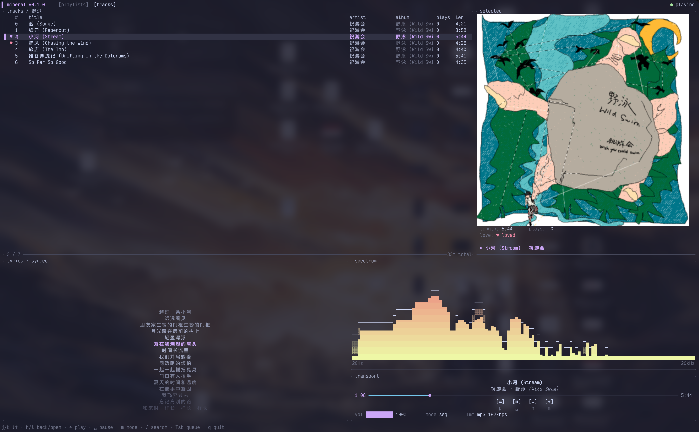
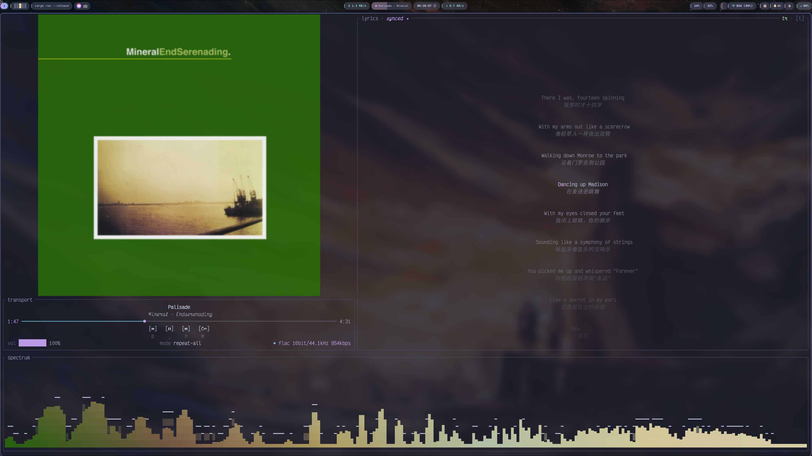

<div align="center">

# Mineral

**多源音乐播放器**

[](https://github.com/10knamesmore/Mineral/actions/workflows/ci.yml)
[](https://aur.archlinux.org/packages/mineral)
[](./LICENSE)


名字取自 [Mineral](<https://en.wikipedia.org/wiki/Mineral_(band)>) —— 90 年代得州的 emo / post-rock 乐队。






</div>

## 特性

- **流畅的终端动画** — 页面切换、全屏展开、列表滚动、菜单开合与歌词滚动都有过渡动画。
- **随音乐变化的配色** — 从专辑封面提取主题色，用于频谱和全屏背景；背景随音乐响度变化。
- **Seek 与 Gapless** — 支持流式播放中的进度跳转，以及跨音乐源的无缝切歌。
- **逐字歌词与音频可视化** — 逐字歌词高亮，提供频谱柱、示波器、瀑布和地形四种可视化样式。
- **多源整合** — 在同一个界面浏览各音乐源的歌单，将不同来源的歌曲加入同一个播放队列；收藏统一汇总到 Favorites 歌单。
- **Client / Daemon 分离** — 播放由独立后台进程负责，可配置关闭界面后继续播放；多个客户端共享播放队列和状态。

## 安装

### Arch Linux(AUR)

```bash
paru -S mineral   # 或 yay -S mineral
```

### Cargo(任意平台,从源码安装)

```bash
# 最新发布版(crates.io)
cargo install --locked mineral

# 跟随主分支
cargo install --locked --git https://github.com/10knamesmore/Mineral mineral
```

需要 Rust ≥ 1.96 与下列系统依赖。

<details>
<summary><b>源码构建依赖</b></summary>

| 平台            | 依赖                                               |
| --------------- | -------------------------------------------------- |
| Arch Linux      | `pacman -S alsa-lib openssl pkgconf`               |
| Debian / Ubuntu | `apt install libasound2-dev libssl-dev pkg-config` |
| macOS           | 无额外依赖(音频走 CoreAudio)                       |

```bash
git clone https://github.com/10knamesmore/Mineral && cd Mineral
cargo build --release
```

</details>

## 快速上手

```bash
mineral                          # 启动 TUI(没有 daemon 会自动拉起)
mineral channel netease login    # 扫码登录
```

<details>
<summary><b>daemon 模式</b></summary>

播放核心跑在独立 daemon 进程,TUI 只是它的一个 client:

| 用法             | 行为                                                                                       |
| ---------------- | ------------------------------------------------------------------------------------------ |
| `mineral`(默认)  | 没有 daemon 就自动拉起一个;**退出 TUI 时带走自己拉起的 daemon**                            |
| 后台常住进程     | 配置 `tui.behavior.kill_spawned_daemon_on_exit = false` 后,退出 TUI 不会停止daemon继续模仿 |
| `mineral serve`  | 手动起常驻 daemon                                                                          |
| `mineral status` | 命令行查看当前播放状态                                                                     |
| `mineral stop`   | 让 daemon 优雅退出;没在跑时也算成功(幂等)                                                  |

</details>

## 配置

> [!WARNING]
> Mineral 仍在积极开发中,每次版本迭代都可能新增 / 调整 / 移除配置项,字段名与默认值也可能变。
> mineral 默认配置足够开箱即用， 建议暂不要依赖过多配置项
>
> ```bash
> mineral config init    # init lua lsp things
> mineral config check   # 离线校验现有 config.lua 在新版本下是否还合法
> ```
>
> `config init` 不会覆盖你已有的 `config.lua`,只更新类型注解与 `default.lua` 参考

参考 [文档](/docs/configuration.md)

## 快捷键

<details open>
<summary><b>全局</b></summary>

| 键        | 动作                                            |
| --------- | ----------------------------------------------- |
| `Space`   | 播放 / 暂停                                     |
| `n` / `p` | 下一首 / 上一首(`p` 在播放 > 3s 时回到本曲开头) |
| `←` / `→` | 后退 / 前进 5s(`Shift` 加持 30s)                |
| `+` / `-` | 音量 ±5(别名 `=` / `_`)                         |
| `m`       | 循环模式:顺序 → 随机 → 列表循环 → 单曲循环      |
| `z`       | 进 / 退全屏沉浸态                               |
| `Tab`     | 播放队列浮层                                    |
| `t`       | 歌词副轨:原文 → 翻译 → 罗马音                   |
| `x`       | 关闭通知卡片(连按逐条关)                        |
| `s`       | 打开搜索(进入在线搜索视图)                      |
| `q`       | 退出(带确认)                                    |
| `?`       | 打开快捷键帮助(app 内完整键表)                  |

`ctrl-c`(退出tui, 不动daemon) 与 `shift + q`(退出tui与daemon) 无法重映射

</details>

<details>
<summary><b>列表(playlists / library)</b></summary>

| 键                        | 动作                  |
| ------------------------- | --------------------- |
| `j` / `k`(或 `↓` / `↑`)   | 上下移动 1 行         |
| `J` / `K`                 | 上下移动 7 行         |
| `g` / `G`                 | 跳到行首 / 末         |
| `Ctrl-d` / `Ctrl-u`       | 下 / 上滚             |
| `Ctrl-f` / `Ctrl-b`       | 翻页                  |
| `l` / `Enter`             | 进入歌单 / 播放选中曲 |
| `h` / `Esc` / `Backspace` | 返回                  |
| `/`                       | 搜索(fuzzy + 拼音)    |
| `f`                       | 切换 favorate         |
| `d`                       | 下载                  |
| `Ctrl-l`                  | 进入详情页            |
| `[` / `]`                 | 详情页分区切换        |
| `o`                       | 操作菜单              |
| `y`                       | 复制菜单              |

</details>

<details>
<summary><b>播放队列浮层(<code>Tab</code> 打开)</b></summary>

| 键                  | 动作                    |
| ------------------- | ----------------------- |
| `c`                 | 光标跳回在播条目        |
| `Ctrl-j` / `Ctrl-k` | 选中条目下移 / 上移一格 |

</details>

<details>
<summary><b>搜索输入态</b></summary>

| 键                 | 动作                  |
| ------------------ | --------------------- |
| 字符 / `Backspace` | 增 / 删过滤词         |
| `←` / `→`          | 移动光标)             |
| `Home` / `End`     | 光标跳首 / 尾         |
| `Enter`            | 退出输入态,过滤词保留 |
| `Esc`              | 清过滤词 + 退出输入态 |

</details>

## 路径

遵循 XDG Base Directory:

| 用途                          | 路径                                                |
| ----------------------------- | --------------------------------------------------- |
| 配置                          | `~/.config/mineral/config.lua`                      |
| 数据(凭证、统计、per-song KV) | `~/.local/share/mineral`                            |
| 缓存(封面、音频流缓存)        | `~/.cache/mineral`                                  |
| 下载导出                      | `~/Music/mineral`                                   |
| 日志                          | `~/.cache/mineral/mineral.log.YYYY-MM-DD`(按天轮转) |

## 开发

```bash
cargo snap                                # test + review insta snap
cargo clippy
cargo fmt
cargo dylint --all -- --locked --workspace --all-targets  # custom lint
cargo run --release                      # run TUI
```

## 致谢

感谢以下项目带来的启发与参考:

- [ratatui](https://github.com/ratatui/ratatui) — 优秀的 Rust TUI 框架
- [yazi](https://github.com/sxyazi/yazi) — 终端文件管理器,图像渲染细节上学到很多
- [go-musicfox](https://github.com/go-musicfox/go-musicfox) — 设计与交互上的参考
- [YesPlayMusic](https://github.com/qier222/YesPlayMusic) — 歌词解析的参考
- [termusic](https://github.com/tramhao/termusic) — 同类 Rust TUI 播放器,值得借鉴的工程实践

## 许可证

[MIT](./LICENSE)
