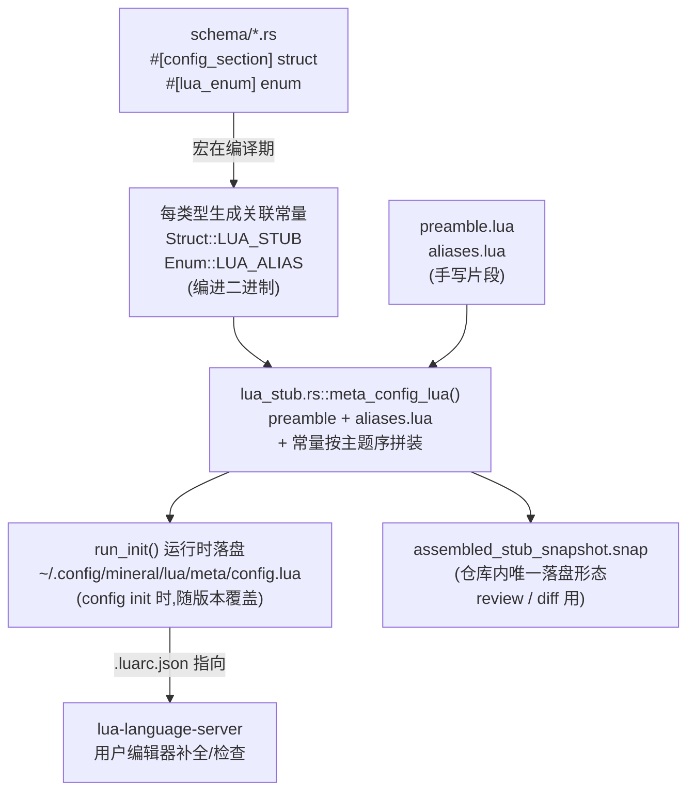

# 配置 schema 与 LuaCATS stub 生成

> 这是**维护向**文档:讲配置 schema 的类型注解(`meta/config.lua`)怎么来的、改 schema 时要动哪里。
> 用户向的「每个旋钮是什么/默认多少」看 [configuration.md](./configuration.md)。

## 一句话

用户在编辑器里写 `config.lua` 时看到的字段补全 / 类型检查 / 悬浮文档,来自一份 LuaCATS 类型 stub(`~/.config/mineral/lua/meta/config.lua`)。**这份 stub 不是手写的**——它是 Rust 配置 schema(`crates/mineral-config/src/schema/*.rs` 里的 struct / enum)经宏投影出来的。改字段**只改 Rust**,stub 自动跟。

**核心动机**:配置 schema 从前散在三处——Rust struct、`default.lua`(默认值)、`meta/config.lua`(类型注解),改一处忘另一处就 drift(埋点系统合入时 stats 段就漏进了 stub,animation 也少两个字段)。现在 Rust struct 是**单一真相源**,其余两者要么由 serde 落型钉死(default.lua),要么由宏生成(stub)。

## 数据流



关键点:仓库里**没有**完整的 `meta/config.lua` 源文件——它的字段/class 部分活在 Rust struct 定义里,语法型 alias 和文件头说明是 `lua/meta/` 下的手写片段。生成全文在仓库里的唯一落盘形态是那份 insta 快照。

## 文件地图

| 文件 | 性质 | 作用 |
|---|---|---|
| `crates/mineral-config-macros/src/lib.rs` | 手写 | 三个 attribute 宏入口:`config_section` / `source_section` / `lua_enum` |
| `crates/mineral-config-macros/src/lua_stub.rs` | 手写 | 生成逻辑:`map_type`(类型映射)/ `class_stub`(struct→class)/ `enum_alias`(enum→alias)/ helper attr 解析 |
| `crates/mineral-config/src/lua_stub.rs` | 手写 | 拼装 `meta_config_lua()` + 拼装清单 + 全部守卫测试 |
| `crates/mineral-config/src/lua/meta/preamble.lua` | 手写 | stub 文件头(`---@meta` + 使用说明 prose) |
| `crates/mineral-config/src/lua/meta/aliases.lua` | 手写 | 语法型 alias(联合值)+ untagged 复合枚举 |
| `crates/mineral-config/src/lua/meta/mineral.lua` | 手写 | **host API** stub(脚本 API 的类型,`mineral.player` 等)。**不属于本系统**,与配置 schema 无关,单独维护 |
| `crates/mineral-config/src/init.rs` | 手写 | `run_init` 调 `meta_config_lua()` 落盘 |
| `crates/mineral-config/src/schema/*.rs` | 手写 | **单一真相源**:struct / enum 定义 + `///` 文档 |
| `default.lua` | 手写 | 默认值唯一真相源(与本系统正交,见下「与 default.lua 的关系」) |

## 怎么改 —— 按任务查

| 任务 | 动作 | 忘了会怎样 |
|---|---|---|
| 加 / 删 / 改字段 | 只改 Rust struct 字段 + `///` + `default.lua` 默认值 | 什么都不用额外记,stub 自动跟。快照红 → `cargo snap` review |
| 新增配置段 struct | 打 `#[config_section]`,**挂进 `lua_stub.rs` 的拼装清单** | 漏挂清单 + 有父字段引用它 → 闭合性测试红,点名缺谁 |
| 新增封闭枚举 | 打 `#[lua_enum]`,**挂进 `lua_stub.rs` 的 enum alias 清单** | 缺 `rename_all` / 带载荷 → 编译错;漏清单 → 闭合性红 |
| 函数字段(落型前被摘走) | struct 打 `#[lua_extra_field("名[?]", "类型", "描述")]` | 见下「函数字段」——这是唯一纯人肉点 |
| 类型映射不合意 | 字段打 `#[lua_type("...")]` 覆盖 | 未知类型形态默认 `mineral.<Name>` 引用,无定义 → 闭合性红 |
| 数组元素 struct(不过深合并) | struct 打 `#[lua_optional_by_serde]` | 见下「可选性」 |
| 改 `ColorValue` 等语法型值语法 | 手写同步 `aliases.lua` | 见下「手写残留」 |

## 宏怎么映射类型

`map_type`(`mineral-config-macros/src/lua_stub.rs`)按语法层规则:

| Rust | LuaCATS |
|---|---|
| `bool` | `boolean` |
| `u8`..`u128` / `usize` / `i8`..`isize` | `integer` |
| `f32` / `f64` | `number` |
| `String` / `char` / `PathBuf` | `string` |
| `Option<T>` | 映射 `T`(剥壳) |
| `Vec<T>` | `映射(T)[]` |
| `FxHashMap<String, T>` / `HashMap<String, T>` | `table<string, 映射(T)>` |
| 其余无泛型路径类型 `Foo` | `mineral.Foo`(约定引用) |
| 引用 / 元组 / 未知泛型 | **编译错**,提示用 `#[lua_type]` |

「其余路径类型 → `mineral.Foo`」是约定:宏不检查 `mineral.Foo` 是否真有定义,那由**闭合性测试**在拼装侧兜底(见下)。要扩展映射表(比如支持新的容器类型),改 `map_type` 的 `match`。

## 可选性(`?` 标记)

两种模式,由 `OptionalMode` 决定:

- **配置段(默认)**:全字段标 `?`。因为配置过**深合并**——用户省略任何字段都合法(回落 `default.lua`),LSP 不该报 missing-fields。
- **数组元素(`#[lua_optional_by_serde]`)**:可选性按 serde 真实语义(`Option<T>` 或 `#[serde(default)]` 才 `?`)。因为数组**整体替换不过深合并**,元素内该必填的就必填。例:`CopyTemplate` 的 `label` 必填(无 `?`)、`key` / `context` 可选(带 `?`)。

字段名以 serde 落型名为准(`#[serde(rename = "loop")]` → stub 里是 `loop` 不是 `loop_`)。

## 函数字段(唯一纯人肉点)

有些字段是 Lua function,过不了 serde——加载管线在落型前把它们摘进 VM registry(见 `loader/pipeline.rs::extract_lua_fns`)。这些字段 **Rust struct 里根本没有**,宏看不见,只能手工声明:

```rust
#[config_section]
#[lua_extra_field(
    "template",                                        // 名字,尾缀 ? 表示可选
    "fun(e: mineral.Song|mineral.Playlist): string",   // LuaCATS 类型
    "渲染函数,返回进剪贴板的文本"                        // 描述
)]
pub struct CopyTemplate { /* key/label/context 三个真实字段 */ }
```

全仓当前有 5 处:`copy.templates[].template` + 四处 `curate_playlists`(跨源一处 + 每个源 section 一处)。

**新增函数字段时**:在 `extract_lua_fns` 挂提取器的同时,给对应 struct 补 `#[lua_extra_field]`。这条人肉关联记在 `extract_lua_fns` 的注释旁。守卫方向是安全的——stub 声明了而 Rust 没摘 → 快照会变;但「Rust 摘了而 stub 没声明」查不到(树里本就没有),靠这条纪律兜。

## 守卫 —— 各拦什么

全在 `crates/mineral-config/src/lua_stub.rs` 的 `#[cfg(test)]` 里(除宏单测在 macros crate):

| 守卫测试 | 拦什么 |
|---|---|
| **宏编译错** | 未知类型映射、`lua_enum` 缺 `rename_all` / 带载荷变体 |
| `assembled_stub_is_reference_closed` | **闭合性**:产物里引用的每个 `mineral.X` 都必须有定义(本产物 or `mineral.lua`)。新 struct 忘挂拼装清单、字段引用了没写 alias 的叶子 → 红 |
| `assembled_stub_snapshot` | 产物全文快照。任何 schema 变更对用户可见面的影响都要 `cargo snap` review 一次 |
| `stub_free_of_rust_only_boilerplate` | 「字段私有 / non_exhaustive / getter」这类 Rust 实现约定语、rustdoc `[`x`]` 链接语法漏进用户面 stub |
| `model_enum_aliases_match_variants` | 跨 crate 枚举(`BitRate` / `SearchKind`,挂不了宏)的手写 alias 值集与变体序列化漂移 |
| `handwritten_alias_literals_deserialize` | 手写 alias 的字面量成员(`AnsiSlot` 槽名 / `MenuAlign` 关键字 / `RetentionDays` 形态)能否被真实 `Deserialize` 接受 |

宏本身的单测(映射规则、class 渲染、serde rename、extra field、strip)在 `mineral-config-macros/src/lua_stub.rs`。

**守卫查不到的**(诚实边界):Rust 摘走函数字段而 stub 没声明(见上);`ColorValue` 等 C 档语法型 alias 的**形态结构**变了(见下)。

## 手写残留 —— 为什么这些生成不了

`aliases.lua` 里的 alias 是**联合值语法**(字符串 | 表 | 布尔混写),对应 Rust 侧的自定义 `Deserialize`(手写 Visitor),没法从单一类型机械投影。按同步保证强度分三档:

- **A 档(已机械钉死)**:`BitRate`、`SearchKind`——变体守卫逐变体 serialize 与 alias 比对,漂移必红。形式手写,实质自动同步。
- **B 档(字面量守卫)**:`AnsiSlot`(16 槽名)、`MenuAlign`(3 关键字)、`RetentionDays`(`false|integer`)——`handwritten_alias_literals_deserialize` 把每个字面量喂真实 Deserialize,写错字 / Rust 收紧接受集就红。
- **C 档(纯手写)**:`ColorValue` / `ColorRef` / `KeyBinding` / `TimeFormat` 的**形态结构**、`CuratePlaylistsFn` 签名、`TitleSegment`(untagged 复合枚举摊成的 class)——「语法」是 Visitor 里的任意代码或纯 Lua 概念,宏与测试都够不着全自动。改对应 Visitor 时**顺手改 `aliases.lua`**,Rust 侧各自模块已有的 Visitor 行为测试锚住落型正确性。C 档的变更频率 = 值语法大改,一年难得一次。

## 关键不变量 —— 别踩

- **`config_section` 刻意不加 `#[serde(default)]`**。这是整条链的地基:因为每个字段都是必填,`default.lua` 少一个字段 → `Config::defaults()` 落型报 missing → `defaults_snapshot` 测试红;多一个 → `deny_unknown_fields` 拒。**一旦给字段挂 `serde(default)`,`default.lua` 的完整性守卫就静默失效**。要给字段默认值,写进 `default.lua`,不要用 `serde(default)`。
- **`///` 文档 = 用户 LSP hover 文本**。写字段语义 / 取值范围 / 权衡 / 警示,面向配置用户。别写「字段私有 / 经 getter 读取 / non_exhaustive」这类 Rust 实现约定语(守卫会拦)。rustdoc 的 `[`x`]` 链接语法由宏自动剥成反引号内文,可以照常用。
- **默认值类描述不进 `///`**。比如「默认 B 站品牌粉」——这与 `default.lua` 形成双数据源,默认改了文档就 rot。默认值让 `default.lua` 说。

## 与 default.lua 的关系

两条独立的守卫链,合起来让配置 schema 有单一真相源:

```
default.lua  ⇔  Rust struct     ← serde 必填 + deny_unknown_fields(编译期/测试期)
meta stub    ⇐  Rust struct     ← 宏生成(编译期投影)
aliases.lua(手写残留)          ← 闭合性 + 变体守卫 + 字面量守卫(检测性)
```

`default.lua` 的完整性由 serde 落型钉死(靠上面那条「不加 serde(default)」的不变量);stub 由宏从同一份 struct 投影。所以「Rust 加字段」自动传导到两边:default.lua 不补会红,stub 自动生成。
